# Business-Analytics-Capstone-Consultancy-Project
This Microsoft PowerPoint-based report is the culmination of a 4-month Capstone consultancy project completed as part of my 1-year postgraduate Business Analytics program at Seneca College, Toronto.
  
**Project Highlights**:
  - Comprehensive Data Analysis: Managed and analyzed large, complex data sets, delivering actionable insights to address real-world business challenges in Canada.
  - Leadership & Execution: Successfully led the Business Analytics project from inception to completion, coordinating tasks, timelines, and team collaboration.
  - Skills in Action: Applied a robust mix of analytical tools and methodologies, showcasing the practical application of knowledge gained during the course.
    
**Technical Tools and Techniques**:
- Excel: Performed initial data wrangling, processing, and exploratory analysis.
- Tableau: Executed advanced data merging, appending, regression analysis, and created compelling visualizations.
- Python (Google Colab): Leveraged Python for natural language processing, including creating a word cloud based on text from the Fraser Report.
  
**Key Takeaways**:
- This project was an invaluable opportunity to demonstrate the integration of technical and storytelling skills, critical for effective data-driven decision-making. It reinforces the principle that "Knowledge is not power until applied" – Dale Carnegie.
- By blending tools like Python, Tableau, and Excel with strategic thinking and communication, the project exemplifies my skills in leveraging data to drive actionable insights in real world.

**Title Page**
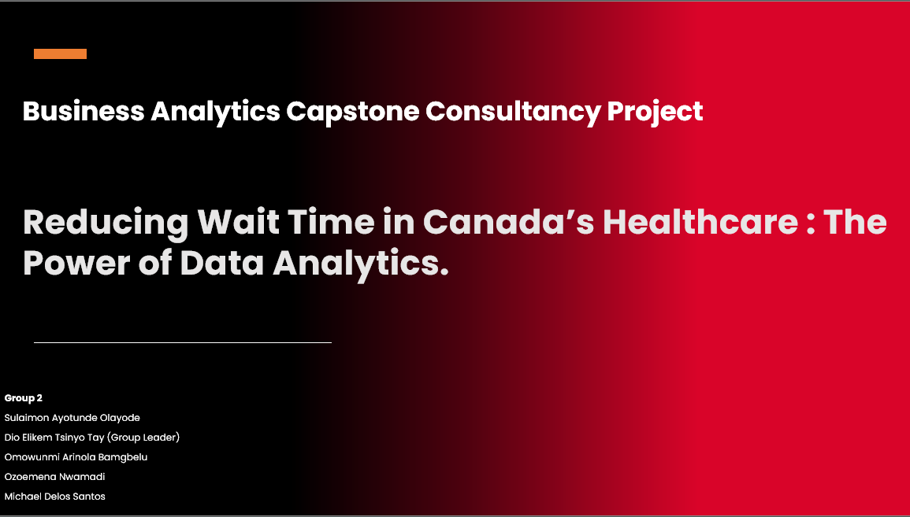
---
**Agenda**
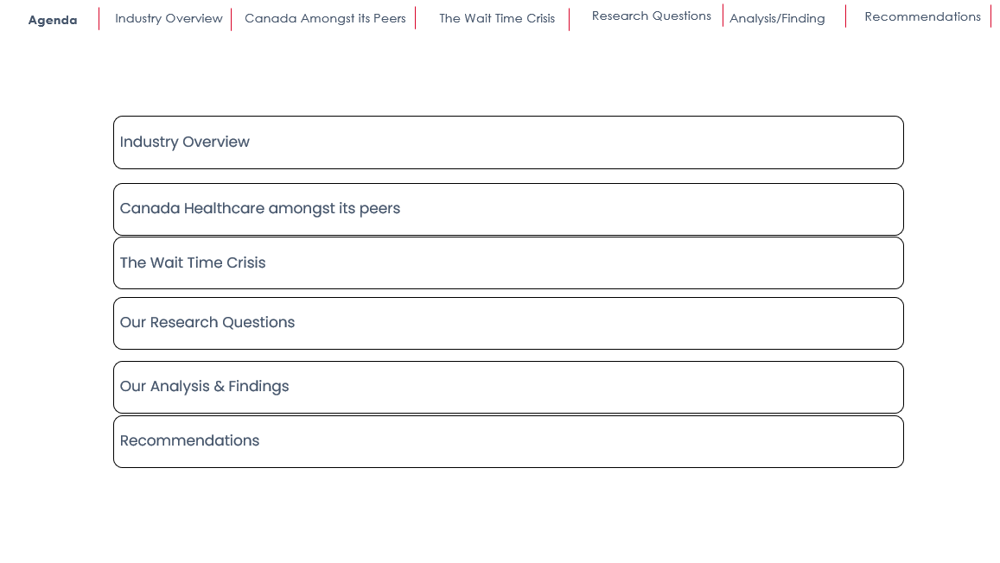
---
**Healthcare Industry Overview**
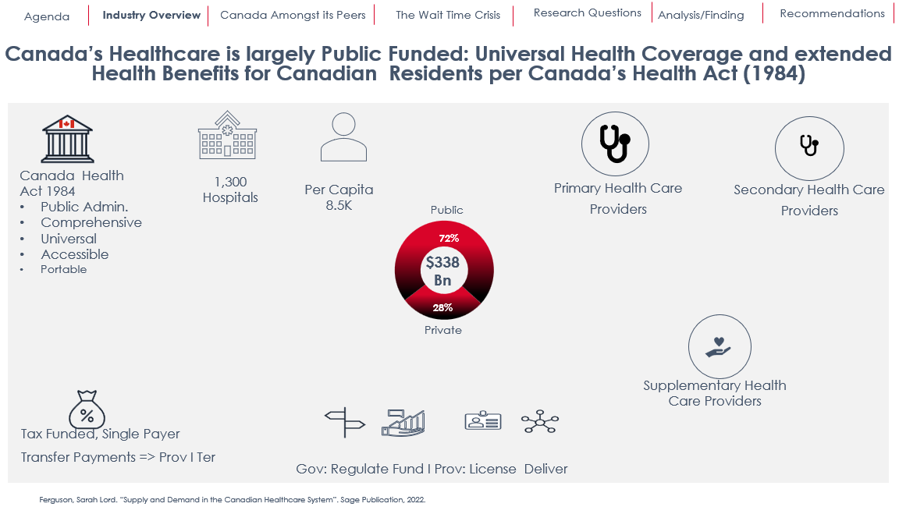
---
**Canada Among Its Peers (OCED Countries)**
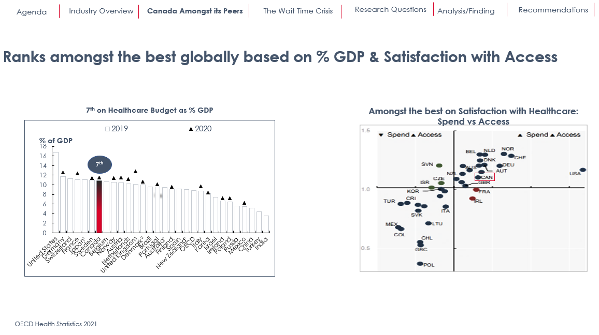
---
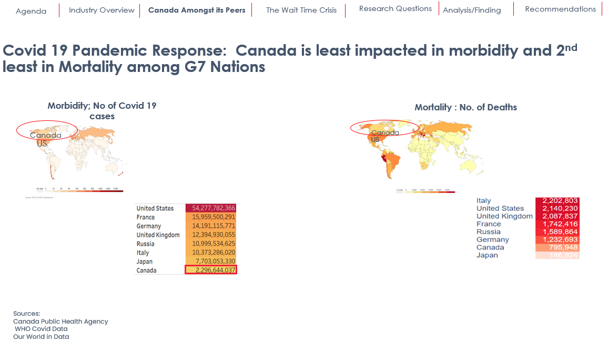
---
**The Wait Time Crisis**
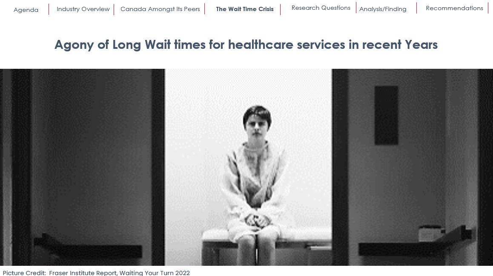
---
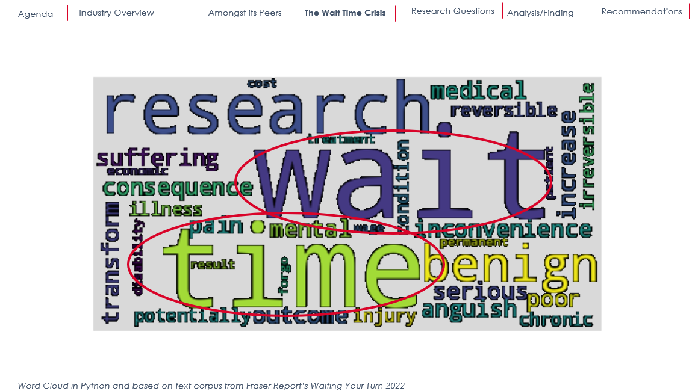
---

---
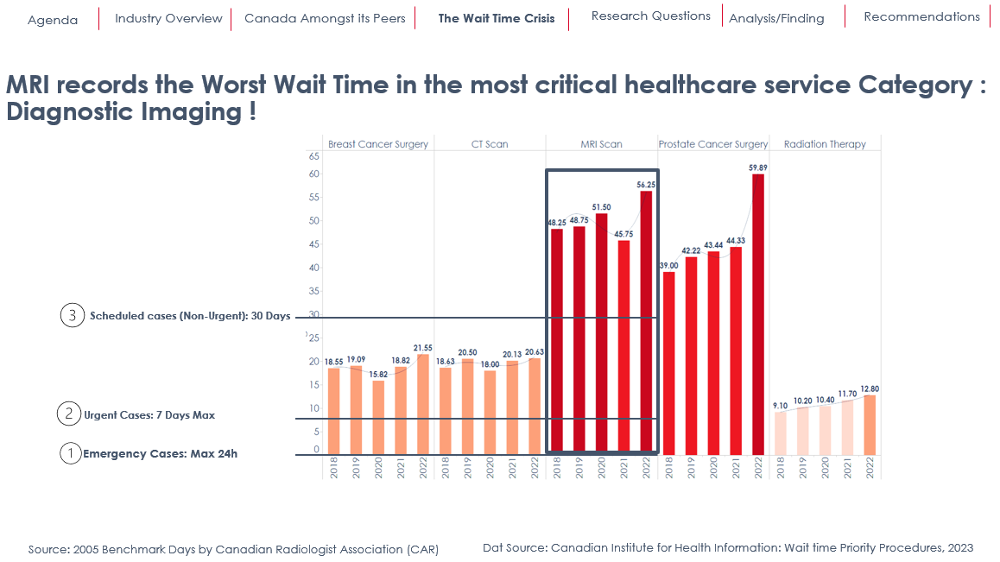
---
**Research Questions**
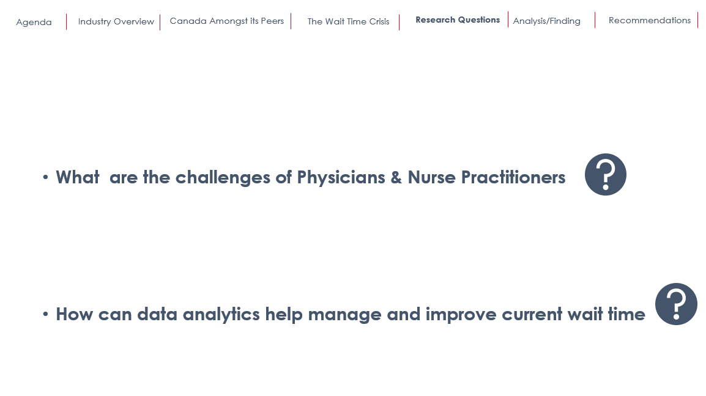
---
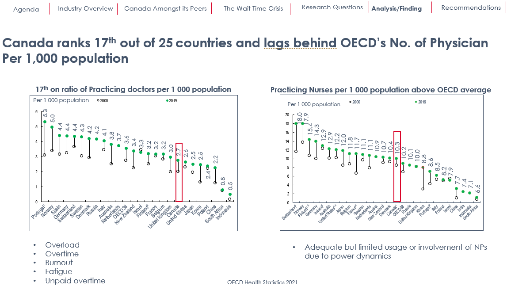
---
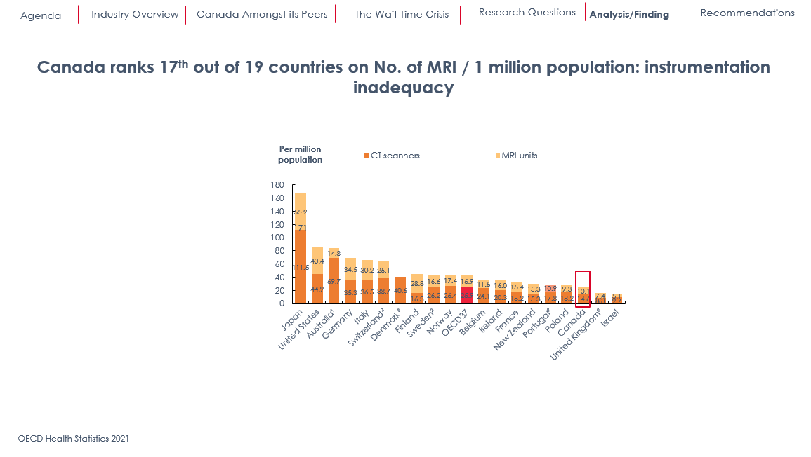
---
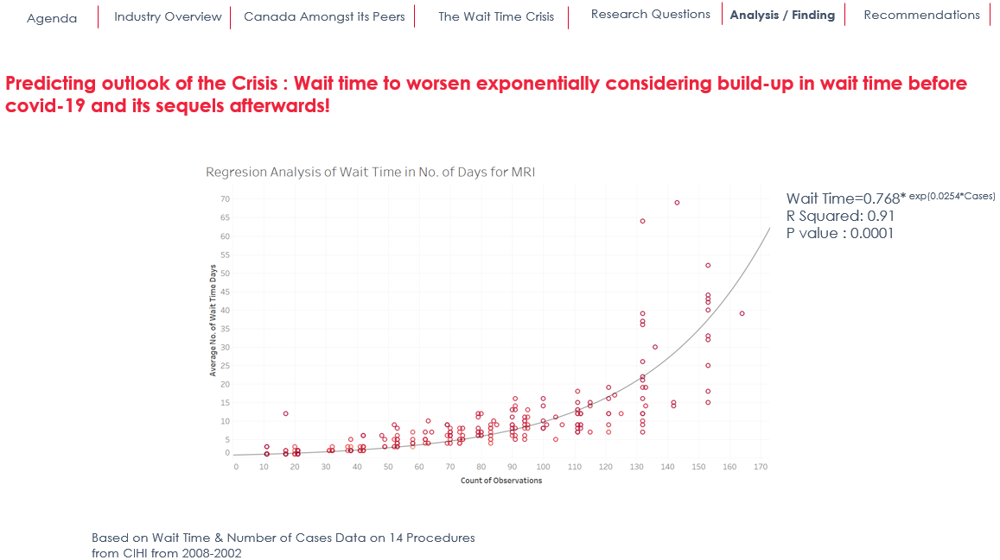
---
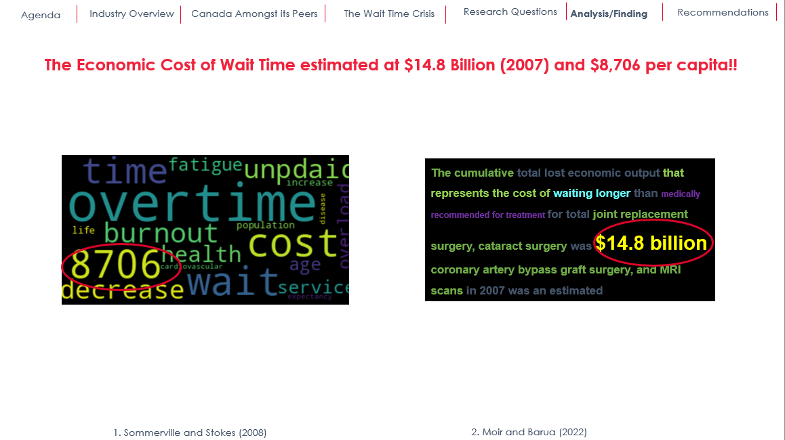
---
**Findings**
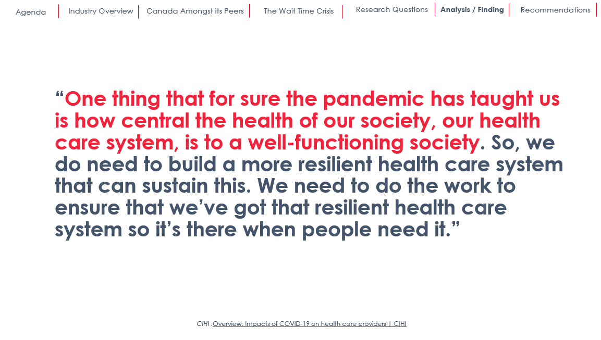
---
**Recommendations**
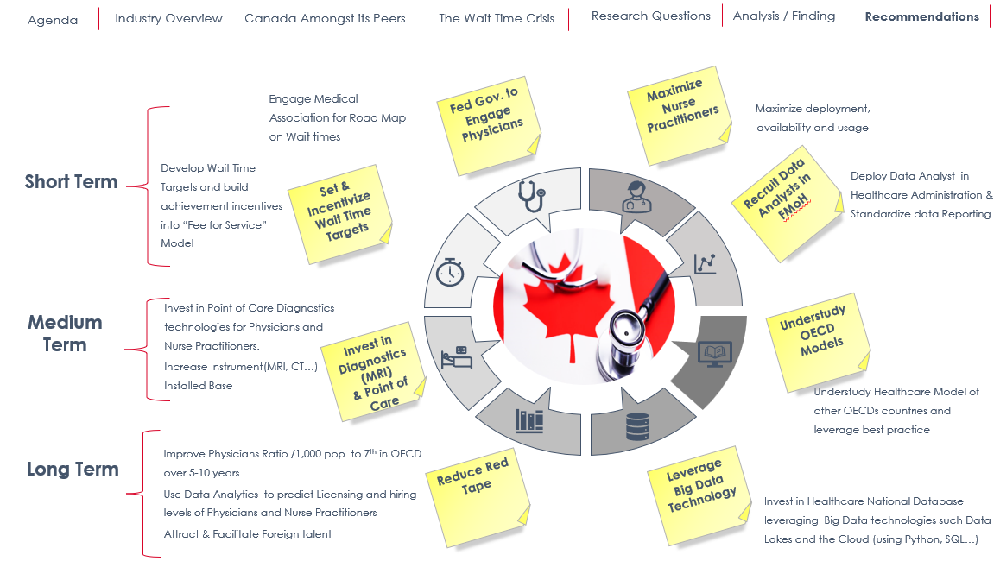
---
