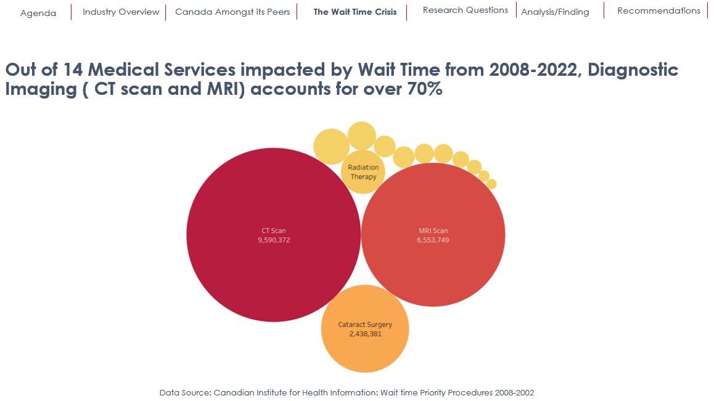

# Business-Analytics-Capstone-Consultancy-Project

These Microsoft PowerPoint-based reports was part of a Capstone consultancy project towards completion of my 1-year Business Analytics postgraduate course at Seneca College, Toronto. It showcases not only my ability to handle large and complex data sets and draw actionable insights but also lead business Analytics projects and Teams effectively. It was a great opportunity to apply and showcase all the concepts and skills learned during the course and their application to a real-life situation in Canada. "Knowledge is not Power until applied"! Dale Carnegie. 
Data wrangling and processing in Excel and Tableau. The PowerPoint was designed and delivered live using storytelling with Data techniques.

